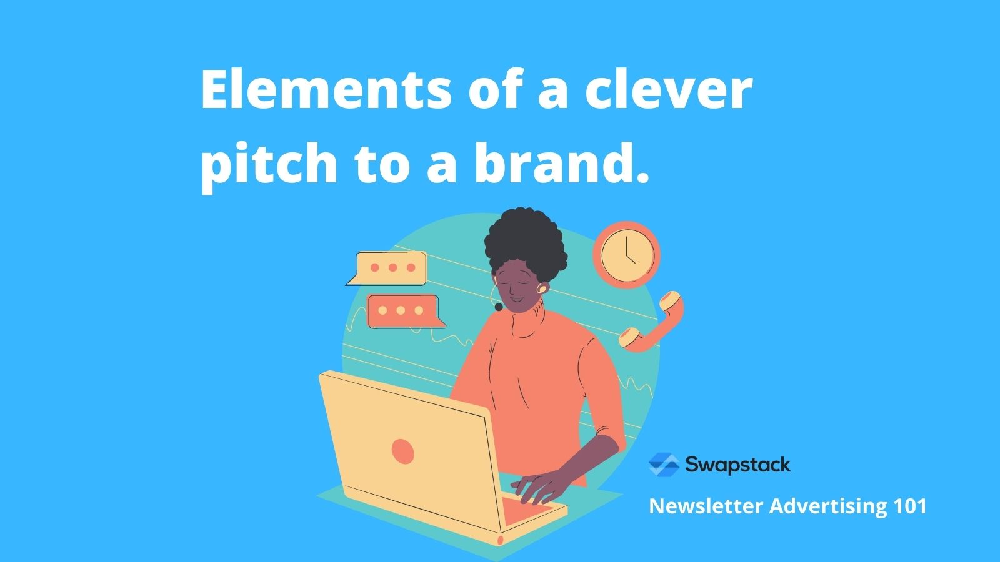

In this post, we'll talk through the important elements of building an initial relationship with a potential sponsor.

This article is transcribed from our video interview with Justin Moore and Jake Schonberger, which can be found [here](https://youtu.be/0L9nYwercfg).

**\[Q] Anangsha:** So Justin & Jake, I'd like to know what are some of the most important elements of a clever pitch to a brand.

**\[A]** **Justin Moore:** Sure. So when we're talking about clever pitches to brands, the number one thing not to do is to just contact the brand or the person responsible for the marketing spend and say, "Hey, I love your brand. Let's collaborate."

You know, you might think, "Well, duh!", right? That's not compelling. But in my experience, this is what 97% of creators do when they reach out to brands. So yes, there are important principles when pitching a potential sponsor. I've created a framework called the ROPE method, which I have used for years extremely successfully.

And it stands for Relevant, Organic, Persistent, and Easy to execute.:

1. Relevant is relevant to a campaign that they're working on.
2. Organic means that you can tie your pitch back to content that you've already posted or written about.
3. Persistent is that you don't give up after one email.
4. And, Easy to execute when they say, "Yes!"

How much more powerful do you think a pitch will be when you can:

* Illustrate to a brand that you've actually done your homework on them
* Understand what they're trying to accomplish
* AND already speak to the types of customers that they're trying to reach.

**\[A]** **Jake Schonberger:** Yeah, so generally I agree with everything Justin said. A couple of things that I would add are, when you reach out to a brand, and we help with a lot of this on Swapstack through the outreach mechanism:

* **Availability**: make sure that the brand knows about your availability. Meaning when they can go live with an ad, if they want to.
* [Newsletter Pricing](https://swapstack.co/newsletter-pricing-101/) is very important. Brands want to know how much it costs to actually work with you and what kind of ROI they're going to see. So we also help with this through Swapstack. You can create [Newsletter Ad listings](https://swapstack.co/newsletter-ad-units-101/) to show your pricing, but make sure that whenever you pitch out to send a pitch to a brand, even if you're doing a cold call or a cold outreach, include your pricing.
* **Performance**: Include examples of how the ad might work, and include examples of previous ads that have driven good ROI.

Overall, you want to give them all the tools that they need to be able to make a decision on if they want to work with you. And most of the time, the brand wants to be able to drive or understand their ROI. The easier it is for a brand to visualize a successful relationship, to quicker they'll be to say, "Yes, let's do it!"

**Anangsha:** Those are such valuable insights. Thank you, Jake and Justin for sharing them.

Watch the full video below:

<iframe width="560" height="315" src="https://www.youtube.com/embed/0L9nYwercfg" title="YouTube video player" frameborder="0" allow="accelerometer; autoplay; clipboard-write; encrypted-media; gyroscope; picture-in-picture" allowfullscreen></iframe>